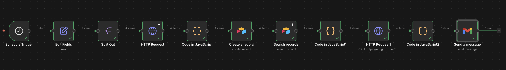

# Competitor Intelligence Monitor

An end-to-end automated pipeline that scrapes 4 competitor websites daily and delivers an AI-powered email digest every morning at 9am with zero manual effort.

**Competitors tracked:** Webflow, Framer, Maze, Penpot

---

## What it does

Every morning, this system automatically:
1. Scrapes the latest content from 4 competitor websites
2. Compares today's content against yesterday's stored data
3. Detects changes in pricing, new features, and positioning
4. Uses an LLM to generate a plain-English summary of what changed
5. Sends a formatted email digest to your inbox at 9am

No dashboards to check. No manual research. Just open your email.

---

## Demo

### Workflow (n8n)


### Data storage (Airtable)


### Email digest output


---

## Architecture

```
Schedule Trigger (9am daily)
        ↓
Edit Fields — define competitor URLs
        ↓
Split Out — process each competitor separately
        ↓
HTTP Request — scrape competitor website
(custom headers to bypass bot detection)
        ↓
Code (JavaScript) — clean raw HTML, extract meaningful content
        ↓
Airtable: Create Record — store today's scraped content with timestamp
        ↓
Airtable: Search Records — fetch yesterday's stored content
        ↓
Code (JavaScript) — diff today vs yesterday, prepare LLM prompt
        ↓
HTTP Request → Groq API (LLaMA) — AI analysis of changes
        ↓
Code (JavaScript) — format AI output into HTML email
        ↓
Gmail — send digest email
```

---

## Key technical decisions

**Bot detection bypass**: Engineered custom HTTP request headers to successfully scrape all 4 competitor domains without being blocked.

**Day-over-day comparison**:  Used Airtable as a lightweight historical database with timestamp-based querying to enable accurate yesterday-vs-today diffs.

**Groq LLM for speed**: Used Groq's API (LLaMA model) instead of OpenAI for significantly faster inference at lower cost, ideal for daily batch processing.

**JavaScript data cleaning**: Wrote custom JS logic to strip raw HTML noise, extract meaningful text content, match records by competitor name, and format AI output into readable email sections.

---

## Tech stack

| Layer | Tool |
|---|---|
| Automation | n8n |
| Web scraping | n8n HTTP Request node + custom headers |
| AI analysis | Groq API (LLaMA) |
| Data storage | Airtable |
| Email delivery | Gmail |
| Logic / transforms | JavaScript (n8n Code nodes) |

---

## Results

- **Fully automated**: runs daily at 9am with zero manual intervention
- **4 competitors monitored**: Webflow, Framer, Maze, Penpot
- **Detects:** pricing changes, new feature announcements, positioning shifts
- **Replaces** ~30–45 minutes of daily manual competitor research

---

## How to run this yourself

### Prerequisites
- n8n (cloud or self-hosted)
- Airtable account (free tier works)
- Groq API key- [groq.com](https://groq.com) (free tier available)
- Gmail account with OAuth set up in n8n

### Setup steps
1. Import the `competitor-monitor.json` workflow file into n8n
2. Create an Airtable base with fields: `competitor`, `pageType`, `url`, `scrapedAt`, `cleanedContent`
3. Add your credentials in n8n: Airtable API key, Groq API key, Gmail OAuth
4. Update the competitor URLs in the Edit Fields node
5. Activate the workflow- it will run daily at 9am

---

## Project structure

```
competitor-intelligence-monitor/
├── competitor-monitor.json       ← n8n workflow (import this)
├── workflow.png                  ← n8n workflow screenshot
├── data-storage airtable.png     ← data storage screenshot
├── email digest.png              ← sample email output screenshot
└── README.md
```

---

## What I learned

- How to handle bot detection in web scraping using custom HTTP headers
- How to use Airtable as a time-series data store for automation workflows
- Prompt engineering for structured comparison outputs using LLMs
- JavaScript string manipulation and HTML parsing in n8n Code nodes
- Building reliable scheduled automation with error-resilient design

---

## Author

Built by Anshika Gupta · https://www.linkedin.com/in/anshika-gupta1008/ · https://github.com/AnshikaGupta0124
